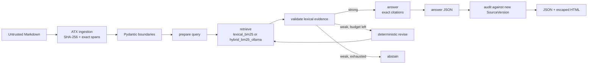

# Architecture

`StateGraph(GraphState)` uses a `TypedDict` internally and Pydantic models at every
public boundary. Nodes return state updates. The graph is compiled before invocation;
conditional edges route validation outcomes, and the revision edge loops only while the
validated counter permits it.

Each citation carries document ID, source hash and path, heading path, chunk ID, quote,
and exact half-open offsets. Audit comparisons are per citation: exact quote at the old
offset is unchanged, exact quote elsewhere is relocated, a similar replacement section
is changed, absent content is deleted, and an absent document is source-missing.
